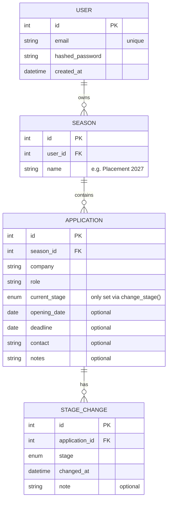

# Design – Application Tracker

A web app for tracking job and placement applications, from roles that haven't opened yet through to offers.

**Who it's for:** mainly students and grads.

## Features (this version)

1. Add applications at any stage, including roles not open yet
2. Change the status of an application
3. See stats: response rate, stages reached, applications per week
4. Create seasons to group applications (e.g. placement search vs part-time job search)
5. Account creation and login
6. Edit and delete an application

## Out of scope

- Email reminders
- Mobile app

## Future work

- Recommendations for new places to apply, based on past applications
- Scraping job sites so everything is centralised

## Planned stack

FastAPI, SQLModel, PostgreSQL (SQLite for early experiments), pytest, React, Docker, GitHub Actions.

## Data model

### Stages

**Progression (display order):** Not open yet → To apply → Applied → Online assessment → Video interview → Interview → Assessment centre → Offer → Accepted

**Endings:** Rejected, Withdrawn, Declined

- *Video interview* = one-way recorded (HireVue-style). *Interview* = any live interview, whatever the format.

## Design decisions

### 1. `current_stage` is stored, and only `change_stage()` writes it

`Application.current_stage` duplicates the latest `StageChange` row (denormalised) so that filtering and listing by stage is a simple query.

**The rule:** every stage change goes through one function, `change_stage(application, new_stage)`, which in a single transaction:

1. inserts a `StageChange` row, and
2. updates `Application.current_stage`.

- No endpoint or other code writes `current_stage` directly.
- Creating an application also goes through `change_stage()`, so history starts at the first stage with no gap.
- **Test:** after any `change_stage()` call, the latest `StageChange.stage` equals `current_stage`.

### 2. Stages can be skipped, repeated and reopened

Companies run different processes, so there are no transition rules:

- any stage can follow any other (skip ahead, go back, e.g. interview → assessment centre → final interview)
- no locked end states: a rejected or withdrawn application can be reopened
- the stage order above is for display only

### 3. Rounds and formats live in the history, not the stage list

- Multiple rounds = multiple `StageChange` rows at the same stage. No "Interview round 2" stages.
- Interview format (online, in person) and case studies go in `StageChange.note`.

### 4. "Stages reached" counts what happened

For each stage, count the applications with at least one `StageChange` row at that stage. This stays correct whatever order a company uses. The stage an application was rejected at is the `StageChange` row before the rejection.

### 5. Deleting a season

- Allowed at any time, after a warning that all its data will be lost and re-entering your password.
- Cascades in one transaction: season → its applications → their `StageChange` rows.
- The password is checked on the backend against `hashed_password`; the warning dialog is only UI.
- Planned endpoint: `POST /seasons/{id}/delete` with the password in the body (request bodies on `DELETE` aren't reliably supported).
- SQLite ignores foreign-key cascades unless foreign keys are switched on for the connection.

## Open questions

- Applications per week: derive the applied date from the "Applied" `StageChange` row, or store it on `Application`?
- Exact definition of response rate (which stages count as a response?)

## Build plan

- [ ] Day 1 – Spec, data model, repo setup, `/health` endpoint, README skeleton
- [ ] Day 2 – CRUD endpoints for seasons and applications on PostgreSQL
- [ ] Day 3 – Auth (JWT) and unit tests
- [ ] Day 4 – Frontend: list view, add/edit form, filter by stage
- [ ] Day 5 – Docker, CI on every push, deploy
- [ ] Day 6 – Stats
- [ ] Day 7 – README polish, screenshots, bug fixes
